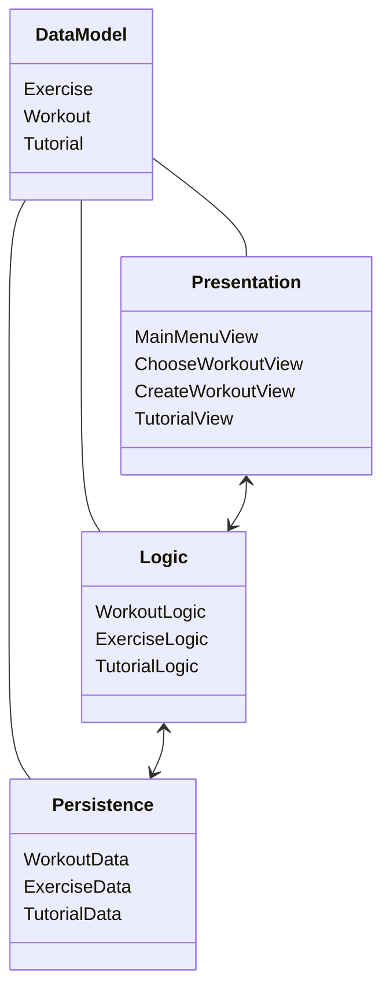

# FitClub Architecture - Iteration 1

```mermaid
classDiagram
    Data Model -- Presentation
    Data Model -- Logic
    Data Model -- Persistence
    Data Model : Exercise
    Data Model : Workout
    Data Model : Tutorial
    class Presentation{
      MainMenuView
      ChooseWorkoutView
      CreateWorkoutView
      TutorialView
    }
    class Logic{
      WorkoutLogic
      ExerciseLogic
      TutorialLogic
    }
    class Persistence{
      WorkoutData
      ExerciseData
      TutorialData
    }

    Logic <--> Persistence
    Presentation <--> Logic
```