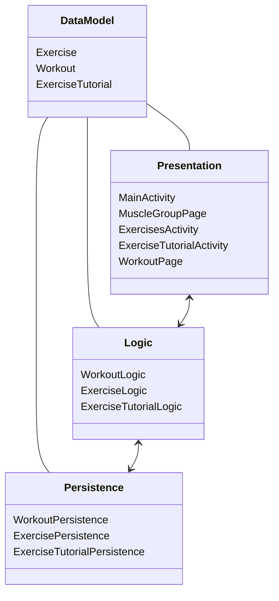

# FitClub Architecture - Iteration 1

```mermaid
classDiagram
    Data Model -- Presentation
    Data Model -- Logic
    Data Model -- Persistence
    Data Model : Exercise
    Data Model : Workout
    Data Model : ExerciseTutorial
    class Presentation{
      MainActivity
      MuscleGroupPage
      ExercisesActivity
      ExerciseTutorialActivity
      WorkoutPage
    }
    class Logic{
      WorkoutLogic
      ExerciseLogic
      ExerciseTutorialLogic
    }
    class Persistence{
      WorkoutPersistence
      ExercisePersistence
      ExerciseTutorialPersistence
    }

    Logic <--> Persistence
    Presentation <--> Logic
```
