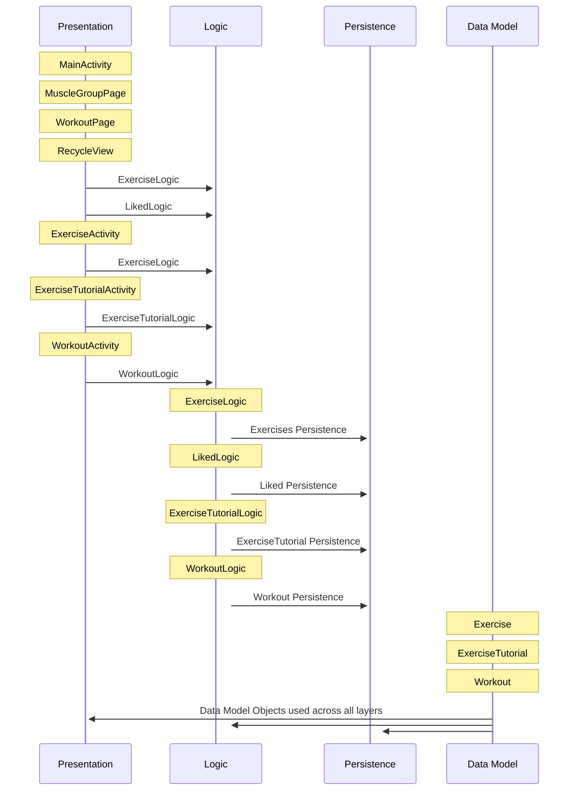

# FitClub Architecture - Iteration 2

```mermaid
sequenceDiagram
    participant Presentation
    participant Logic
    participant Persistence
    participant Data Model
    
    Note over Presentation: MainActivity
    Note over Presentation: MuscleGroupPage
    Note over Presentation: WorkoutPage
    Note over Presentation: RecycleView
    Presentation->>+Logic: ExerciseLogic
    Presentation->>+Logic: LikedLogic
    Note over Presentation: ExerciseActivity
    Presentation->>+Logic: ExerciseLogic
    Note over Presentation: ExerciseTutorialActivity
    Presentation->>+Logic: ExerciseTutorialLogic
    Note over Presentation: WorkoutActivity
    Presentation->>+Logic: WorkoutLogic

    Note over Logic: ExerciseLogic
    Logic->>+Persistence: Exercises Persistence
    Note over Logic: LikedLogic
    Logic->>+Persistence: Liked Persistence
    Note over Logic: ExerciseTutorialLogic
    Logic->>+Persistence: ExerciseTutorial Persistence
    Note over Logic: WorkoutLogic
    Logic->>+Persistence: Workout Persistence

    Note over Data Model: Exercise
    Note over Data Model: ExerciseTutorial
    Note over Data Model: Workout
    Data Model->>+Presentation: Data Model Objects used across all layers
    Data Model->>+Logic: 
    Data Model->>+Persistence:    
```
