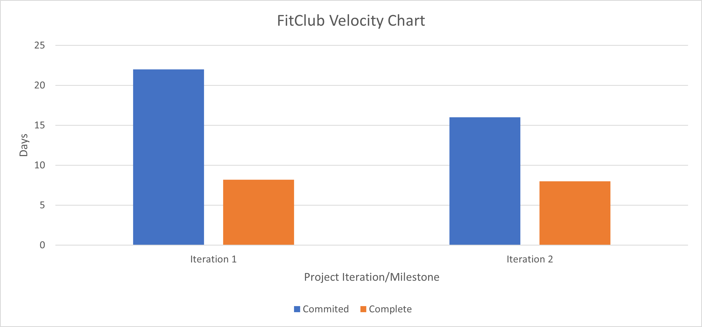

# FitClub Retrospective

One of the things we've found to not be as successful as we imagined when the project first began back in January is the development strategy / workflow of our user stories. The initial plan for the project was to have the entire team be full stack developers, that is to say each team member would be responsible for developing a given user story across all three layers of our n-tiered architecture (presentation, logic, and persistence) in order to avoid having a low bus factor. Each developer was also meant to be responsible for developing a thorough suite of tests that corresponded to that user stories implementation as well. The team identified this method as being less successful than planned because different team members had different levels of experience with different layers of the architecture in the project. The result of this is that some portions of a user story, for example the presentation layer, was taking longer to develop and those user stories were often carried over across multiple iterations. This was problematic as we were already down a member from when the initial vision for the project was development After discussing with the team, we decided that a potential improvement to this would be to change our development workflow so that instead of each team member being a full stack developer, each team member would focus on a specific layer of the architecture. Those that were more experienced and proficient in front end development, specifically Android development, would do the front end portion of user stories and those that were more experienced and proficient in back end development would focus on the persistence layer side of things. 

Moving forward into the development stages of iteration 3 we've decided to break up developer tasks and other tasks and assign them based on who is more comfortable and experienced in that particular layer of the architecture, despite the potential for a bus factor of 1. This workflow improvement will be a success if we are able to complete outstanding developer tasks and stories that have lingered around through multiple iterations due to being hung up on development at a particular architecture layer.

## Project Velocity

